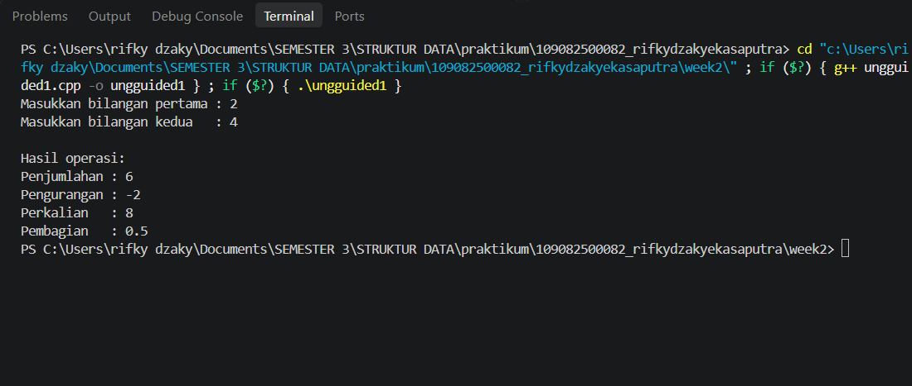
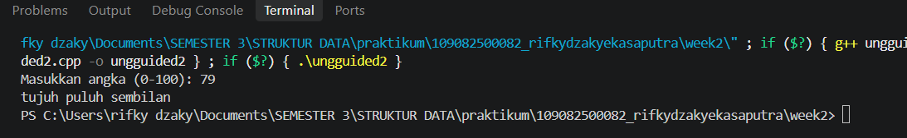
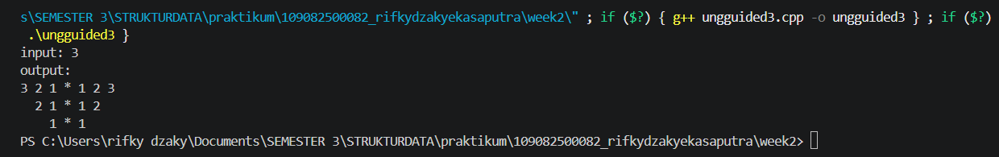

# <h1 align="center">Laporan Praktikum Modul 1 - Codeblocks IDE & Pengenalan Bahas C++ (Bagian Pertama)</h1>
<p align="center">rifky dzaky eka saputra - 109082500082</p>

## Dasar Teori
Bahasa C++ merupakan salah satu bahasa pemrograman yang dapat digunakan untuk mempelajari konsep dasar pemrograman dan struktur data. Penggunaan C++ dalam mata kuliah Struktur Data berkaitan dengan kemampuan mahasiswa dalam memahami syntax, istilah pemrograman, serta penerapan konsep pemrograman ke dalam sebuah program. Penguasaan dasar bahasa C++ menjadi salah satu kompetensi yang penting dalam mempelajari Struktur Data [1].

Dalam pemrograman C++, tipe data dan variabel digunakan untuk menentukan serta menyimpan data yang akan diproses oleh program. Beberapa tipe data dasar yang umum digunakan antara lain int, float, double, dan char. Selain itu, C++ menyediakan berbagai operator yang digunakan untuk melakukan operasi terhadap data, seperti operator aritmatika, assignment, perbandingan, dan logika. Konsep-konsep tersebut menjadi dasar dalam membangun algoritma dan program C++ [1].

Input dan output merupakan bagian penting dalam program karena memungkinkan program menerima data dari pengguna dan menampilkan hasil pemrosesan. Pada C++, cin dapat digunakan untuk menerima masukan, sedangkan cout digunakan untuk menampilkan keluaran. Penggunaan input dan output memungkinkan program berinteraksi dengan pengguna secara langsung.

Program C++ juga menggunakan percabangan untuk melakukan pengambilan keputusan berdasarkan kondisi tertentu. Pernyataan seperti if, if-else, dan switch dapat digunakan untuk menentukan instruksi yang dijalankan berdasarkan nilai atau kondisi yang diberikan. Selain percabangan, perulangan seperti for, while, dan do-while digunakan untuk menjalankan instruksi secara berulang sehingga program menjadi lebih efisien.

Dalam Struktur Data, pemahaman terhadap array dan struct juga menjadi dasar penting. Array digunakan untuk menyimpan sekumpulan data dengan tipe yang sama, sedangkan struct digunakan untuk mengelompokkan beberapa data yang dapat memiliki tipe berbeda ke dalam satu kesatuan. Konsep tersebut menjadi dasar untuk mempelajari struktur data yang lebih kompleks menggunakan C++.

 

## Unguided 

### 1. ungguided 1
Buatlah program yang menerima input-an dua buah bilangan betipe float, kemudian memberikan output-an hasil penjumlahan, pengurangan, perkalian, dan pembagian dari dua bilangan tersebut.

```C++
#include <iostream>
using namespace std;
 
int main() {
    float a, b;
 
    cout << "Masukkan bilangan pertama : ";
    cin >> a;
    cout << "Masukkan bilangan kedua   : ";
    cin >> b;
 
    cout << "\nHasil operasi:" << endl;
    cout << "Penjumlahan : " << (a + b) << endl;
    cout << "Pengurangan : " << (a - b) << endl;
    cout << "Perkalian   : " << (a * b) << endl;
    cout << "Pembagian   : " << (a / b) << endl;
 
    return 0;
}
```
### Output Unguided 1 :

##### Output 1



penjelasan unguided 1 
Program C++ tersebut merupakan kalkulator sederhana yang berfungsi untuk menghitung dua bilangan pecahan (float). Setelah pustaka iostream diimpor dan variabel a serta b dideklarasikan, program meminta input dari pengguna untuk kedua variabel tersebut melalui fungsi cin. Selanjutnya, program secara otomatis menghitung dan menampilkan hasil dari empat operasi aritmetika dasar, yaitu penjumlahan (a + b), pengurangan (a - b), perkalian (a * b), dan pembagian (a / b) sebelum akhirnya menghentikan eksekusi dengan return 0

### 2. ungguided 2
Buatlah sebuah program yang menerima masukan angka dan mengeluarkan output nilai angka tersebut dalam bentuk tulisan. Angka yang akan di-input-kan user adalah bilangan bulat positif mulai dari 0 s.d 100

```C++
#include <iostream>
using namespace std;

int main() {
    int angka;
    
    cout << "Masukkan angka (0-100): ";
    cin >> angka;

    string satuan[] = {
        "nol", "satu", "dua", "tiga", "empat",
        "lima", "enam", "tujuh", "delapan", "sembilan",
        "sepuluh", "sebelas"
    };

    if (angka < 0 || angka > 100) {
        cout << "Angka harus dari 0 sampai 100" << endl;
    }
    else if (angka <= 11) {
        cout << satuan[angka] << endl;
    }
    else if (angka < 20) {
        cout << satuan[angka - 10] << " belas" << endl;
    }
    else if (angka < 100) {
        int puluhan = angka / 10;
        int satuanAngka = angka % 10;

        cout << satuan[puluhan] << " puluh";

        if (satuanAngka != 0) {
            cout << " " << satuan[satuanAngka];
        }

        cout << endl;
    }
    else {
        cout << "seratus" << endl;
    }

    return 0;
}
```
### Output Unguided 2 :

##### Output 1


penjelasan unguided 2
Program C++ di atas berfungsi untuk mengonversi angka bulat dari rentang 0 hingga 100 menjadi bentuk terbilang dalam bahasa Indonesia. Pertama, program meminta masukan angka dari pengguna dan menyimpan kata-kata dasar (0–11) di dalam array satuan. Selanjutnya, logika percabangan if-else memeriksa kondisi nilai angka: jika di luar rentang 0–100, program menampilkan pesan peringatan; jika bernilai 0–11, teks diambil langsung dari array; jika bernilai 12–19, program menggunakan rumus angka - 10 lalu menambah kata "belas"; jika bernilai 20–99, program memisahkan nilai puluhan (angka / 10) dan satuan (angka % 10) untuk membentuk gabungan kata (misalnya "dua puluh tiga"); dan jika angka bernilai 100, program langsung mencetak kata "seratus".

### 3. ungguided 3
Buatlah program yang dapat memberikan input dan output sbb.   input: 3
3 2 1 * 1 2 3
  2 1 * 1 2
    1 * 1
      *


```C++
#include <iostream>
using namespace std;

int main() {
    int n;

    cout << "input: ";
    cin >> n;

    cout << "output:" << endl;

    for (int i = n; i >= 1; i--) {
        
        for (int j = n; j > i; j--) {
            cout << "  ";
        }

        for (int j = i; j >= 1; j--) {
            cout << j << " ";
        }

        cout << "* ";

        for (int j = 1; j <= i; j++) {
            cout << j;
            
            if (j < i) {
                cout << " ";
            }
        }

        cout << endl;
    }

    return 0;
}
```
### Output Unguided 3 :

##### Output 1


penjelasan unguided 3
Program C++ ini berfungsi untuk mencetak pola simetris berbentuk cermin (pola mirror) berbasis angka dan karakter bintang berdasarkan nilai masukan n. Melalui perulangan tingkat luar (for i), program mencetak baris demi baris secara menurun dari n hingga 1. Pada setiap barisnya, terdapat tiga perulangan tingkat dalam: perulangan pertama mencetak spasi untuk membentuk indentasi miring, perulangan kedua mencetak deret angka menurun dari i sampai 1 dipisahkan karakter * di tengahnya, dan perulangan ketiga mencetak deret angka naik dari 1 sampai i. Hasil akhirnya membentuk pola segitiga terbalik angka simetris yang dibatasi simbol bintang di bagian tengah.

## Kesimpulan
Melalui praktikum Modul 1 ini, saya dapat memahami kembali konsep-konsep dasar pemrograman C++, seperti penggunaan variabel, tipe data, perulangan, hingga kondisi percabangan. Dari ketiga latihan yang diselesaikan, saya belajar bagaimana mengolah input pengguna secara langsung untuk kebutuhan aritmetika sederhana, memproses logika terbilang angka berbasis alur if-else dan array, serta membuat pola simetris memanfaatkan perulangan bersarang (nested loop). Keseluruhan materi ini menjadi landasan yang sangat penting buat saya sebelum melangkah ke topik struktur data yang lebih kompleks ke depannya.

## Referensi
[1] Ratnasari, N., & Wibawa, A. P. (2020). Analisis perbandingan kualitas UI/UX platform online coding course pada pembelajaran daring pemrograman komputer dengan metode a/b testing. JEPIN (Jurnal Edukasi dan Penelitian Informatika), 6(2), 210-216. 

