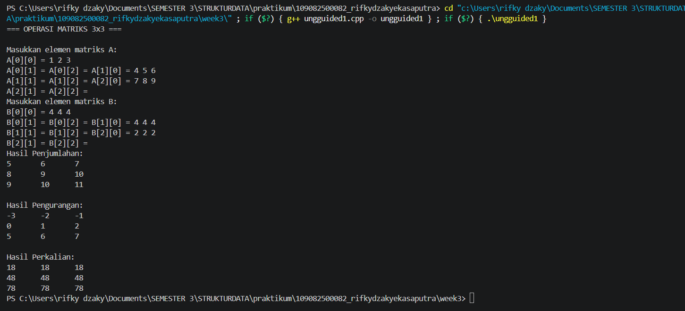
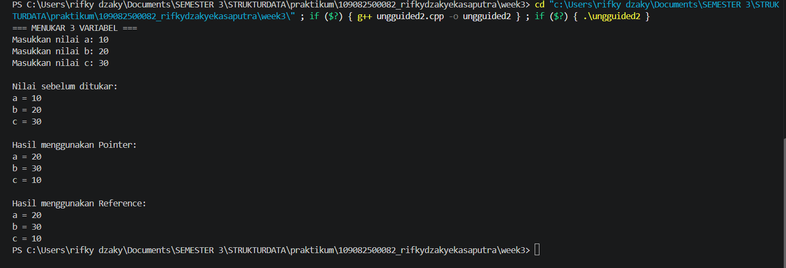
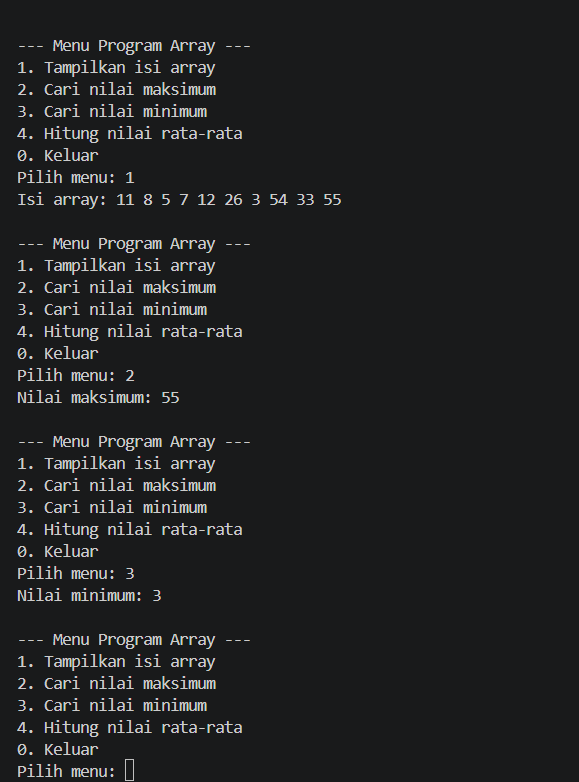

# <h1 align="center">Laporan Praktikum Modul 2 -  PENGENALAN BAHASA C++ (Bagian Kedua)</h1>
<p align="center">Rifky Daky Eka Saputra - 109082500082</p>

## Dasar Teori
Array merupakan struktur data linier pada bahasa C++ yang menyimpan sekumpulan elemen bertipe sejenis secara kontigu pada lokasi memori fisik, sehingga memungkinkan efisiensi waktu akses elemen sebesar $O(1)$ melalui indeksnya meskipun alokasinya bersifat statis [1]. Dalam arsitektur memori komputer, setiap variabel yang dideklarasikan dialokasikan pada alamat fisik tertentu, di mana pointer hadir sebagai variabel khusus untuk menyimpan alamat memori (memory address) tersebut, bukan nilai datanya [1]. Hubungan erat antara keduanya terlihat dari nama variabel array yang pada dasarnya bertindak sebagai pointer konstan yang menunjuk ke alamat memori elemen pertamanya ($index [0]$), sehingga memungkinkan pengaksesan dan manipulasi data secara langsung pada alokasi memori RAM [1].Untuk mengoptimalkan struktur program agar modular dan menghindari duplikasi kode, C++ menerapkan fungsi yang mengembalikan nilai balik (return value) serta prosedur bertipe void untuk mengeksekusi instruksi tanpa nilai balik [1]. Proses pertukaran data antar subprogram tersebut dilakukan melalui pengiriman parameter, baik secara call by value yang hanya menyalin nilai variabel, maupun call by pointer/reference yang melewatkan alamat memori variabel aktualnya [1]. Penggunaan call by pointer/reference sangat krusial dalam pemrosesan data, karena memungkinkan fungsi untuk mengakses dan memodifikasi elemen secara langsung pada lokasi memori aslinya tanpa perlu menyalin seluruh elemen data, sehingga menghemat konsumsi memori dan meningkatkan performa eksekusi program [1].

## Guided 

### 1. ...

```C++
#include <iostream>
using namespace std;

int main() {
    int nilai[5];

    nilai[0] = 80;
    nilai[1] = 85;
    nilai[2] = 90;
    nilai[3] = 75;
    nilai[4] = 95;

    for (int i = 0; i < 5; i++) {
        cout << "index ke-" << i << " = " << nilai[i] << endl;
    }

    return 0;
}
```
Kode program C++ ini diawali dengan mengalokasikan array satu dimensi bernama nilai bertipe integer dengan kapasitas lima elemen melalui instruksi int nilai[5]. Selanjutnya, program melakukan inisialisasi data secara manual ke dalam setiap posisi indeks, dimulai dari nilai[0] senilai 80 hingga nilai[4] senilai 95. Pada tahap akhir, struktur perulangan for (int i = 0; i < 5; i++) digunakan untuk mengeksekusi perintah pencetakan secara sekuensial guna menampilkan urutan posisi indeks beserta nilai elemen yang tersimpan di dalamnya ke layar.

### 2. ...

```C++
#include <iostream>
using namespace std;

int main() {
    int nilai[3][3] = {
        {80, 85, 90},
        {75, 80, 85},
        {90, 95, 100}
    };

    cout << nilai[0][0] << endl; //80
    cout << nilai[1][1] << endl; //80
    cout << nilai[2][2] << " "; //100

    return 0;
}
```
Kode C++ ini nerapin array dua dimensi berukuran 3x3 bertipe integer yang dikasih nama nilai. Pas awal deklarasi, elemennya langsung diisi data angka yang terbagi jadi 3 baris dan 3 kolom. Abis itu, program ngakses dan nampilin elemen tertentu secara spesifik lewat kombinasi indeks baris sama kolomnya. Di kodingan ini, elemen yang diambil cuma di posisi diagonal utama aja, yaitu nilai[0][0] buat baris pertama kolom pertama (80), nilai[1][1] buat baris kedua kolom kedua (80), dan nilai[2][2] buat baris ketiga kolom ketiga (100).

### 3. ...

```C++
#include <iostream>
using namespace std;

int main() {
    int data[2][3][3] = {
        {
            {1, 2, 3},
            {4, 5, 6},
            {7, 8, 9}
        },
        {
            {10, 11, 12},
            {13, 14, 15},
            {16, 17, 18}
        }
    };


    cout << data[0][1][1] << " ";// 5

    return 0;
}
```
Program C++ tersebut digunakan untuk membuat dan menampilkan data dalam bentuk array tiga dimensi yang bernama data. Array ini memiliki ukuran 2 lapisan, 3 baris, dan 3 kolom yang berisi angka dari 1 sampai 18. Perintah cout << data[0][1][1] digunakan untuk mengambil dan menampilkan nilai pada lapisan pertama, baris kedua, dan kolom kedua. Karena indeks array dimulai dari 0, nilai yang diambil adalah 5. Jadi, ketika program dijalankan, output yang dihasilkan adalah 5

### 4. ...
```C++
#include <iostream>
using namespace std;

int main() {
    int data[2][2][2][2] = {
        {
            {
                {1, 2},
                {3, 4}
            },
            {
                {5, 6},
                {7, 8}
            }
        },
        {
            {
                {9, 10},
                {11, 12}
            },
            {
                {13, 14},
                {15, 16}
            }
        }
    };

    cout << data[0][0][0][0] << endl; // 1
    cout << data[1][1][1][1] << endl; // 16

    return 0;
}
```
Program C++ tersebut menggunakan array empat dimensi dengan nama data yang memiliki ukuran 2 × 2 × 2 × 2 dan berisi angka dari 1 sampai 16. Array ini digunakan untuk menyimpan data dalam beberapa tingkatan. Perintah cout pertama menampilkan nilai dari data[0][0][0][0], yaitu 1, sedangkan perintah cout kedua mengambil nilai dari data[1][1][1][1], yaitu 16. Karena indeks array dimulai dari 0, setiap angka dalam indeks menunjukkan posisi data pada masing-masing dimensi. Jadi, output yang dihasilkan adalah angka 1 dan 16 pada baris yang berbeda.


### 5. ...
```C++
#include <iostream>
using namespace std;

int main() {
    char a;
    int j;
    char arr[6];

    arr[3] = 'b';
    a = 'u';
    j = 10;

    cout << a << endl; 
    cout << &a << endl; 

    cout << j << endl; 
    cout << &j << endl; 
    cout << arr[3] << endl;
    cout << &(arr[4]) << endl; 

    return 0;
}
```
Program C++ tersebut digunakan untuk memahami penggunaan variabel, array, dan operator alamat (&). Variabel a bertipe char yang menyimpan karakter 'u', sedangkan variabel j bertipe int yang menyimpan nilai 10. Array arr memiliki 6 elemen, dengan karakter 'b' disimpan pada indeks ke-3. Perintah cout digunakan untuk menampilkan nilai dari setiap variabel, sedangkan operator & berfungsi untuk menampilkan alamat memori tempat variabel tersebut disimpan. Pada arr[3], program akan menampilkan karakter 'b', sementara &(arr[4]) menampilkan alamat memori dari elemen array pada indeks ke-4. Alamat memori yang ditampilkan dapat berbeda-beda setiap kali program dijalankan, tergantung pada lokasi penyimpanan di memori.

### 6. ...
```C++
#include <iostream>
using namespace std;

int main() {
    int x, y;
    int *px;

    x = 87;
    px = &x;
    y = *px;

    cout << "Alamat x= " << &x << endl;
    cout << "Isi px= " << px << endl;
    cout << "Isi X= " << x << endl;
    cout << "Nilai yang ditunjuk px= " << *px << endl;
    cout << "Nilai y= " << y << endl;

    return 0;
}
```
Program C++ tersebut membahas penggunaan pointer untuk menyimpan dan mengakses alamat memori suatu variabel. Variabel x diberi nilai 87, kemudian pointer px digunakan untuk menyimpan alamat memori dari x dengan perintah px = &x. Selanjutnya, nilai yang ditunjuk oleh px diambil menggunakan operator * dan disimpan ke dalam variabel y, sehingga nilai y juga menjadi 87. Perintah cout digunakan untuk menampilkan alamat memori x, isi pointer px, nilai x, nilai yang ditunjuk oleh px, dan nilai y. Dari program ini, dapat dipahami bahwa pointer memungkinkan kita mengakses alamat memori dan mengambil nilai dari variabel yang ditunjuknya.

### 7. ...
```C++
#include <iostream>
#define MAX 5
using namespace std;

int main() {
    int i, j;
    float nilai_total, rata_rata;
    float nilai[MAX];

    static int nilai_tahun[MAX][MAX] = {
        {0, 2, 2, 0, 0},
        {0, 1, 1, 1, 0},
        {0, 3, 3, 3, 0},
        {4, 4, 0, 0, 4},
        {5, 0, 0, 0, 5}
    };

    for (i = 0; i < MAX; i++) {
        cout << "masukkan nilai ke-" << i + 1 << endl;
        cin >> nilai[i];
    }

    cout << "\ndata nilai siswa :\n";

    for (i = 0; i < MAX; i++)
        cout << "nilai k-" << i + 1 << "=" << nilai[i] << endl;

    cout << "\n nilai tahunan : \n";

    for (i = 0; i < MAX; i++) {
        for (j = 0; j < MAX; j++)
            cout << nilai_tahun[i][j];

        cout << "\n";
    }

    return 0;
}
```
Program C++ tersebut digunakan untuk menginput dan menampilkan nilai siswa serta data nilai tahunan menggunakan array satu dimensi dan array dua dimensi. Konstanta MAX ditetapkan sebesar 5, sehingga program dapat menyimpan 5 nilai siswa ke dalam array nilai melalui perulangan for dan input cin. Setelah itu, program menampilkan kembali nilai yang sudah dimasukkan. Selain itu, terdapat array dua dimensi nilai_tahun yang berisi data angka dan ditampilkan menggunakan perulangan bersarang (for di dalam for) untuk menampilkan setiap baris dan kolom. Dengan program ini, kita dapat memahami cara menggunakan array, menerima input, serta menampilkan data secara berulang dengan lebih terstruktur.

### 8. ...
```C++
#include <iostream>
using namespace std;

int main() {
    char nama[] = "strukdat";

    cout << nama << endl;
    cout << nama[3] << endl;

    return 0;
}
```
Program C++ tersebut digunakan untuk membuat array karakter (string) yang bernama nama dengan isi "strukdat". Perintah cout << nama digunakan untuk menampilkan seluruh isi teks, sedangkan nama[3] digunakan untuk mengambil karakter pada indeks ke-3. Karena indeks array dimulai dari 0, karakter pada posisi tersebut adalah u. Jadi, output program akan menampilkan strukdat pada baris pertama dan u pada baris kedua.

## Unguided 

### 1. (Buatlah program C++ untuk menghitung penjumlahan, pengurangan, dan perkalian dari dua buah matriks berukuran $3 \times 3$.)

```C++

#include <iostream>
using namespace std;

int main() {
    int A[3][3], B[3][3];
    int tambah[3][3], kurang[3][3], kali[3][3];

    cout << "=== OPERASI MATRIKS 3x3 ===" << endl;

    cout << "\nMasukkan elemen matriks A:" << endl;
    for (int i = 0; i < 3; i++) {
        for (int j = 0; j < 3; j++) {
            cout << "A[" << i << "][" << j << "] = ";
            cin >> A[i][j];
        }
    }

    cout << "\nMasukkan elemen matriks B:" << endl;
    for (int i = 0; i < 3; i++) {
        for (int j = 0; j < 3; j++) {
            cout << "B[" << i << "][" << j << "] = ";
            cin >> B[i][j];
        }
    }

    for (int i = 0; i < 3; i++) {
        for (int j = 0; j < 3; j++) {
            tambah[i][j] = A[i][j] + B[i][j];
            kurang[i][j] = A[i][j] - B[i][j];
        }
    }

    for (int i = 0; i < 3; i++) {
        for (int j = 0; j < 3; j++) {
            kali[i][j] = 0;
            for (int k = 0; k < 3; k++) {
                kali[i][j] += A[i][k] * B[k][j];
            }
        }
    }

    cout << "\nHasil Penjumlahan:" << endl;
    for (int i = 0; i < 3; i++) {
        for (int j = 0; j < 3; j++) {
            cout << tambah[i][j] << "\t";
        }
        cout << endl;
    }

    cout << "\nHasil Pengurangan:" << endl;
    for (int i = 0; i < 3; i++) {
        for (int j = 0; j < 3; j++) {
            cout << kurang[i][j] << "\t";
        }
        cout << endl;
    }

    cout << "\nHasil Perkalian:" << endl;
    for (int i = 0; i < 3; i++) {
        for (int j = 0; j < 3; j++) {
            cout << kali[i][j] << "\t";
        }
        cout << endl;
    }

    return 0;
}
```
### Output Unguided 1 :

##### Output 1


penjelasan unguided 1 
Program C++ tersebut digunakan untuk melakukan operasi pada dua matriks berukuran 3×3, yaitu matriks A dan B. Program terlebih dahulu meminta pengguna memasukkan setiap elemen dari kedua matriks menggunakan perulangan for. Setelah itu, program menghitung hasil penjumlahan dan pengurangan dengan menjumlahkan atau mengurangkan elemen yang berada pada posisi yang sama. Untuk perkalian matriks, digunakan perulangan tambahan dengan variabel k agar setiap elemen dihitung sesuai aturan perkalian matriks. Hasil dari ketiga operasi tersebut kemudian ditampilkan dalam bentuk matriks. Dengan program ini, kita dapat memahami penggunaan array dua dimensi dan perulangan bersarang dalam pengolahan data matriks.

### 2. (Berdasarkan guided pointer dan reference sebelumnya, buatlah keduanya dapat menukar nilai dari 3 variabel)

```C++

#include <iostream>
using namespace std;

void tukarPointer(int *a, int *b, int *c) {
    int temp = *a;
    *a = *b;
    *b = *c;
    *c = temp;
}

void tukarReference(int &a, int &b, int &c) {
    int temp = a;
    a = b;
    b = c;
    c = temp;
}

int main() {
    int a, b, c;

    cout << "=== MENUKAR 3 VARIABEL ===" << endl;
    cout << "Masukkan nilai a: ";
    cin >> a;
    cout << "Masukkan nilai b: ";
    cin >> b;
    cout << "Masukkan nilai c: ";
    cin >> c;

    cout << "\nNilai sebelum ditukar:" << endl;
    cout << "a = " << a << endl;
    cout << "b = " << b << endl;
    cout << "c = " << c << endl;

    int x = a, y = b, z = c;
    tukarPointer(&x, &y, &z);

    cout << "\nHasil menggunakan Pointer:" << endl;
    cout << "a = " << x << endl;
    cout << "b = " << y << endl;
    cout << "c = " << z << endl;

    tukarReference(a, b, c);

    cout << "\nHasil menggunakan Reference:" << endl;
    cout << "a = " << a << endl;
    cout << "b = " << b << endl;
    cout << "c = " << c << endl;

    return 0;
}
```
### Output Unguided 2 :

##### Output 1


penjelasan unguided 2
Program C++ tersebut digunakan untuk menukar nilai dari tiga variabel dengan dua cara, yaitu menggunakan pointer dan reference. Fungsi tukarPointer() menerima alamat dari ketiga variabel sehingga nilai dapat diubah melalui operator *, sedangkan fungsi tukarReference() menggunakan reference agar perubahan nilai dapat dilakukan langsung pada variabel aslinya. Pada main(), pengguna memasukkan nilai a, b, dan c, kemudian nilai tersebut ditukar dengan urutan a menjadi b, b menjadi c, dan c menjadi a. Program juga membuat salinan x, y, dan z untuk menunjukkan hasil pertukaran menggunakan pointer tanpa mengubah nilai awal. Setelah itu, fungsi reference digunakan untuk menukar nilai a, b, dan c secara langsung.

### 3. (Diketahui sebuah array 1 dimensi sebagai berikut :
   arrA = {11, 8, 5, 7, 12, 26, 3, 54, 33, 55}
   Buatlah program yang dapat mencari nilai minimum, maksimum, dan rata – rata dari array tersebut! Gunakan function cariMinimum() untuk mencari nilai minimum dan function cariMaksimum() untuk mencari nilai maksimum, serta gunakan prosedur hitungRataRata() untuk menghitung nilai rata – rata! Buat program menggunakan menu switch-case seperti berikut ini :

   --- Menu Program Array ---
   1. Tampilkan isi array
   2. cari nilai maksimum
   3. cari nilai minimum
   4. Hitung nilai rata - rata)

```C++

#include <iostream>
using namespace std;

int cariMinimum(int arr[], int n) {
    int min = arr[0];

    for (int i = 1; i < n; i++) {
        if (arr[i] < min) {
            min = arr[i];
        }
    }

    return min;
}

int cariMaksimum(int arr[], int n) {
    int maks = arr[0];

    for (int i = 1; i < n; i++) {
        if (arr[i] > maks) {
            maks = arr[i];
        }
    }

    return maks;
}

void hitungRataRata(int arr[], int n) {
    int total = 0;

    for (int i = 0; i < n; i++) {
        total += arr[i];
    }

    double rataRata = (double) total / n;
    cout << "Nilai rata-rata: " << rataRata << endl;
}

int main() {
    int arrA[10] = {11, 8, 5, 7, 12, 26, 3, 54, 33, 55};
    int pilihan;
    int n = 10;

    do {
        cout << "\n--- Menu Program Array ---" << endl;
        cout << "1. Tampilkan isi array" << endl;
        cout << "2. Cari nilai maksimum" << endl;
        cout << "3. Cari nilai minimum" << endl;
        cout << "4. Hitung nilai rata-rata" << endl;
        cout << "0. Keluar" << endl;
        cout << "Pilih menu: ";
        cin >> pilihan;

        switch (pilihan) {
            case 1:
                cout << "Isi array: ";
                for (int i = 0; i < n; i++) {
                    cout << arrA[i] << " ";
                }
                cout << endl;
                break;

            case 2:
                cout << "Nilai maksimum: "
                     << cariMaksimum(arrA, n) << endl;
                break;

            case 3:
                cout << "Nilai minimum: "
                     << cariMinimum(arrA, n) << endl;
                break;

            case 4:
                hitungRataRata(arrA, n);
                break;

            case 0:
                cout << "Program selesai." << endl;
                break;

            default:
                cout << "Pilihan tidak valid!" << endl;
        }

    } while (pilihan != 0);

    return 0;
}
```
### Output Unguided 3 :

##### Output 1


penjelasan unguided 3
Program C++ tersebut digunakan untuk mengolah data dalam array yang berisi 10 nilai. Program menyediakan beberapa menu, yaitu menampilkan isi array, mencari nilai maksimum, mencari nilai minimum, dan menghitung nilai rata-rata. Fungsi cariMaksimum() dan cariMinimum() digunakan untuk mencari nilai terbesar dan terkecil dengan melakukan pengecekan setiap elemen array, sedangkan hitungRataRata() menjumlahkan seluruh nilai lalu membaginya dengan jumlah data. Menu program dibuat menggunakan switch dan perulangan do-while, sehingga pengguna dapat memilih menu berulang kali sampai memilih angka 0 untuk keluar.

## Kesimpulan

Berdasarkan praktikum Modul 2 tentang pengenalan bahasa C++ bagian kedua, dapat disimpulkan bahwa C++ memiliki berbagai fitur yang dapat digunakan untuk mengolah dan mengatur data, seperti array, pointer, reference, function, procedure, dan struktur perulangan. Melalui praktikum ini, dapat dipahami cara menggunakan array satu dimensi maupun multidimensi, mengakses data berdasarkan indeks, serta mengolah data dalam bentuk matriks. Selain itu, penggunaan pointer dan reference juga membantu dalam memahami cara mengakses alamat memori dan mengubah nilai variabel melalui sebuah fungsi. Pembuatan function dan procedure membuat program menjadi lebih terstruktur karena setiap proses dapat dipisahkan sesuai tugasnya. Dari beberapa program yang telah dibuat, dapat diketahui bahwa penggunaan konsep-konsep tersebut dapat mempermudah proses pengolahan data dan membuat program C++ lebih terorganisir.


## Referensi
[1] Widodo, B., & Lestari, N. (2021). Analisis perbandingan efisiensi struktur data array dan linked list dalam bahasa C++. Jurnal Informatika, 15(1), 88–96.
